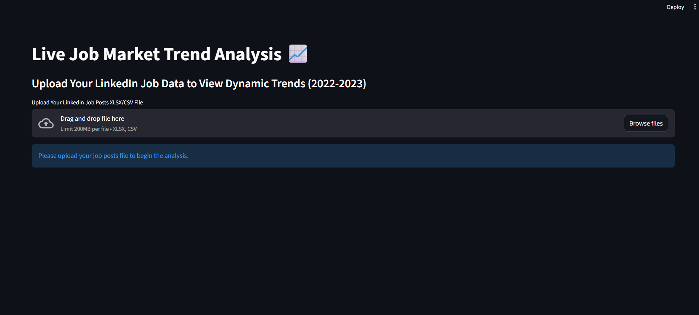
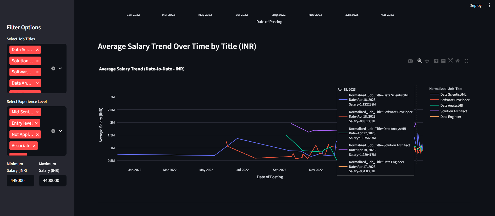
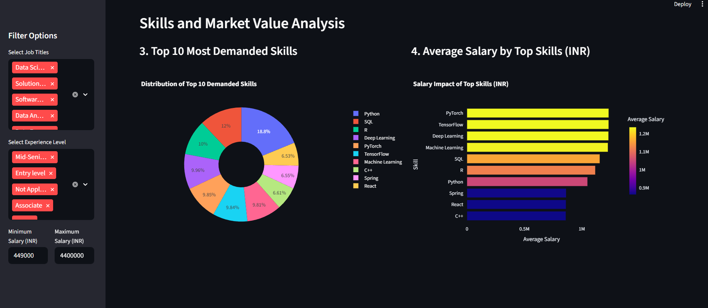

# LinkedIn Job Market Trend Analysis Dashboard

## Project Overview

An interactive data analytics dashboard built using Streamlit to analyze LinkedIn job posting trends, hiring demand, skill requirements, and salary insights.

This application performs data cleaning, normalization, feature engineering, and dynamic filtering to generate meaningful business insights.

## Key Features

- Job title normalization using regex-based preprocessing
- Salary estimation using experience-level multipliers
- Time-series analysis of job demand trends
- Average salary trend visualization
- Top hiring companies analysis
- Top demanded skills visualization (Donut chart)
- Salary impact by skill analysis
- Interactive sidebar filters

## Tech Stack

- Python
- Streamlit
- Pandas
- NumPy
- Plotly
- OpenPyXL

## How to Run

1. Install dependencies:
   pip install -r requirements.txt

2. Run the app:
   streamlit run app.py

## Dataset

This application requires users to upload their own LinkedIn job dataset in CSV or XLSX format.

Expected columns:
- Date
- Job_Title
- Experience_Level
- Industry
- Company_Name

## Engineering Highlights

- Structured data preprocessing pipeline
- Feature engineering for salary imputation
- Modular function-based design
- Interactive UI with real-time filtering
## Preview

